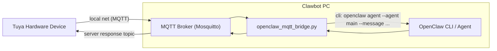

# MQTT OpenClaw Bridge

Minimal MQTT bridge that forwards messages to OpenClaw and publishes responses back.

Chinese documentation: `README_ZH.md`

## What it does

- Subscribes to `openclaw/device/user_speech_text`
- Sends message to `openclaw agent --agent main --message "..."`
- Publishes result to `openclaw/server/response`

## Requirements

- Python 3
- MQTT broker (Mosquitto recommended)
- OpenClaw installed and available as `openclaw`

## What is Mosquitto?

Mosquitto is a lightweight MQTT broker.  
In this project, it acts as the message hub:
- the bridge monitors `openclaw/device/user_speech_text` from Tuya hardware devices
- this bridge consumes the command, calls OpenClaw, then publishes results
- devices read results from topic `openclaw/server/response`

## Installation

Step 1 (no sudo): install Python dependency in user space.

```bash
cd ~/mqtt_openclaw_bridge
pip3 install --user -r requirements.txt
```

Step 2 (requires sudo): install and start Mosquitto broker.

```bash
sudo bash install.sh install-mosquitto
```

Manual equivalent:

```bash
sudo apt-get update
sudo apt-get install -y mosquitto mosquitto-clients
sudo systemctl enable --now mosquitto
```

Optional: use the unified helper script (interactive):

```bash
cd ~/mqtt_openclaw_bridge
bash install.sh
```

## Run

```bash
cd ~/mqtt_openclaw_bridge
python3 openclaw_mqtt_bridge.py
```

## Test

Use Mosquitto CLI only (no test scripts):

Terminal A (watch responses):

```bash
mosquitto_sub -h localhost -t openclaw/server/response -v
```

Terminal B (send one message):

```bash
mosquitto_pub -h localhost -t openclaw/device/user_speech_text -m "Hello from MQTT"
```

## Message format

Plain text:

```text
Hello from MQTT
```

JSON:

```json
{
  "message": "Hello from MQTT",
  "request_id": "req-123"
}
```

Response example:

```json
{
  "timestamp": "2026-02-13T10:30:00.123456",
  "request_id": "req-123",
  "message": "Hello from MQTT",
  "response": "...",
  "status": "success"
}
```

## Configuration (environment variables)

- `MQTT_BROKER` (default in current code: `192.168.100.132`)
- `MQTT_PORT` (default: `1883`)
- `MQTT_TOPIC_IN_COMMAND` / `MQTT_TOPIC_CMD` (default: `openclaw/device/user_speech_text`)
- `MQTT_TOPIC_OUT_RESULT` / `MQTT_TOPIC_RET` (default: `openclaw/server/response`)
- `MQTT_CLIENT_ID` (optional; auto-generated if not set)

## Network topology




Use `MQTT_BROKER` to choose the broker address seen by `openclaw_mqtt_bridge.py`:

- If Mosquitto runs on the same machine as `openclaw_mqtt_bridge.py`, `localhost` (or `127.0.0.1`) is correct.
- If the MQTT broker runs on another machine (LAN, remote host, or public internet), you must set a specific IP or domain.
- Local broker on same host: `MQTT_BROKER=127.0.0.1`
- Remote broker on LAN: `MQTT_BROKER=192.168.100.132`
- Remote/public broker: `MQTT_BROKER=mqtt.example.com`

Example:

```bash
export MQTT_BROKER=192.168.1.50
export MQTT_PORT=1883
python3 openclaw_mqtt_bridge.py
```

## LAN notes

- Make sure broker host/port is reachable from clients.
- If Mosquitto is local-only, configure it to listen on LAN interface (for example `0.0.0.0:1883`).
- Config template path in this repo: `configs/mosquitto_listen_all.conf`.
- Open firewall port `1883/tcp` when needed.

## Troubleshooting

- Broker connection error: `sudo systemctl status mosquitto`
- Port check: `ss -tlnp | rg 1883`
- OpenClaw check: `which openclaw && openclaw --version`
- Logs: `tail -f mqtt_bridge.log`

## Script commands

`install.sh` is now the main script:

```bash
bash install.sh                   # same as: bash install.sh all
bash install.sh deps
bash install.sh broker
bash install.sh openclaw
sudo bash install.sh install-mosquitto
sudo bash install.sh mosquitto-listen-all
bash install.sh test-help
```

`mosquitto-listen-all` uses template file: `configs/mosquitto_listen_all.conf`.
